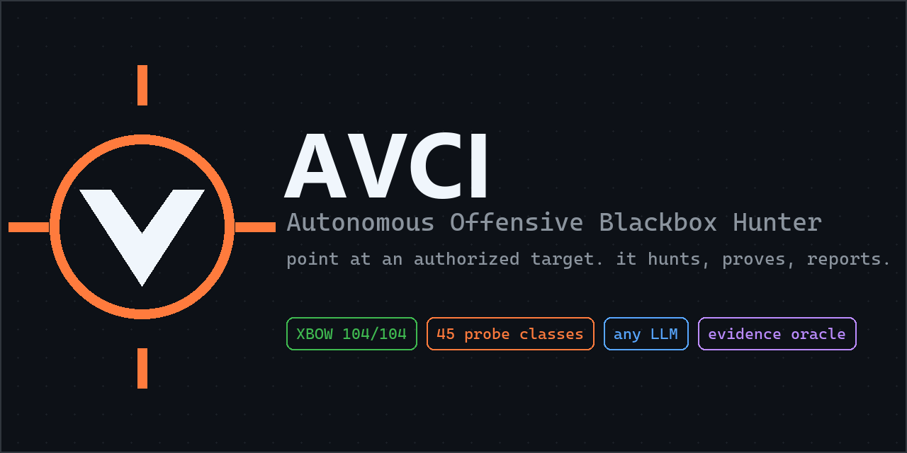
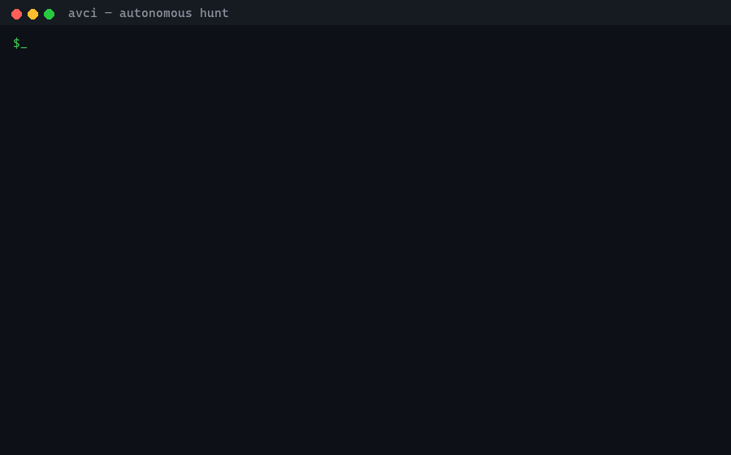
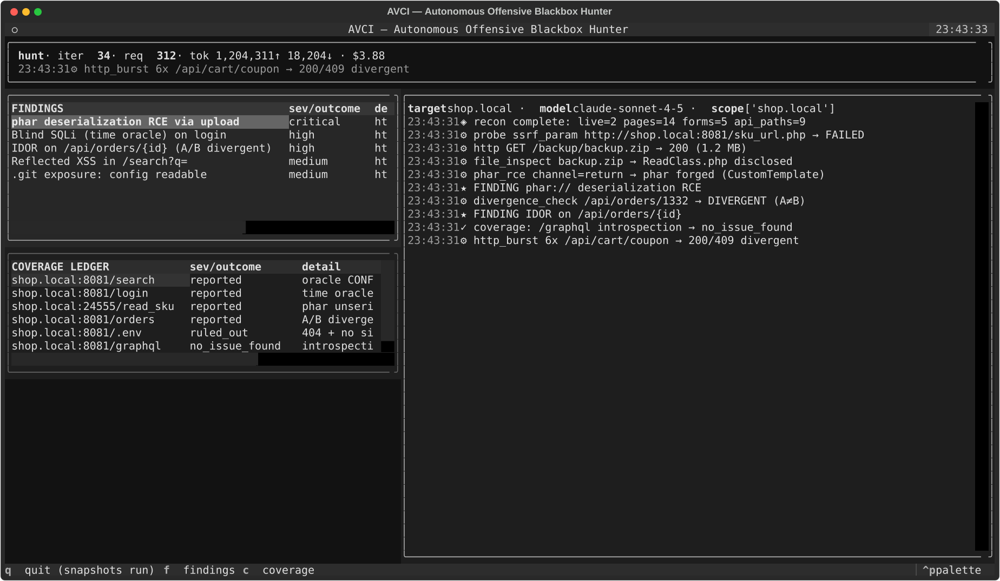
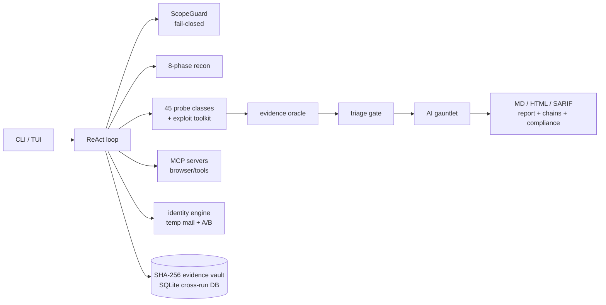

<p align="center">
  
</p>

<p align="center">
  <a href="LICENSE"></a>
  <a href="https://github.com/TiaMEOWS/avci/actions/workflows/ci.yml"></a>
  
  
  
  
</p>

<p align="center">
  <b>Point AVCI at an authorized domain and walk away.</b><br>
  It recons every surface, registers accounts with disposable inboxes, hunts
  authenticated and unauthenticated bugs, proves every claim through an
  evidence oracle, and writes the report — while refusing to leave scope.
</p>

<p align="center">
  
</p>

---

## Why AVCI

- **True blackbox.** A cold URL is enough. No source, no config, no hints —
  the agent builds its own surface model and threat model, then hunts.
- **Proof, not vibes.** Every finding needs verbatim request/response
  evidence and passes a deterministic oracle (CONFIRMED/FAILED/PENDING with
  receipts), a triage gate that rejects vectorless claims, and an
  adversarial AI gauntlet that tries to kill each finding at run end.
  What's left is real.
- **Any LLM.** Claude, GPT, DeepSeek, Kimi, Gemini, GLM, or a local model —
  one env var switches brains via LiteLLM. See
  [docs/models.md](docs/models.md).
- **Built for the long run.** Per-host token-bucket rate limiting with
  429/5xx backoff, deterministic context compaction, checkpoint/resume,
  provider-outage grace retries (`AVCI_LLM_GRACE`), tamper-evident
  evidence vault, full request audit log.
- **104/104 on XBOW.** Validated against the complete XBOW
  validation-benchmarks suite — every challenge, every difficulty level.
  Full pass@N across attempts; pass@1 is 65/104 (62%) — methodology and
  honest metrics: [docs/xbow.md](docs/xbow.md).

## Quickstart

```bash
pip install -e .            # core: httpx, litellm, mcp
pip install -e ".[browser,vault,tui,report]"   # everything

# pick a brain (any one of these)
export ANTHROPIC_API_KEY=sk-ant-...     # default model: claude-sonnet-4-5
# export OPENAI_API_KEY=...             # + AVCI_LLM_MODEL=gpt-5
# export DEEPSEEK_API_KEY=...           # + AVCI_LLM_MODEL=deepseek/deepseek-chat
# export MOONSHOT_API_KEY=...           # + AVCI_LLM_MODEL=moonshot/kimi-k2-0711-preview

avci doctor                             # preflight: LLM, deps, MCP, binaries

# hunt — only ever at targets you are authorized to test
avci hunt --scope example.com "*.example.com"
avci hunt --scope example.com --tui     # live dashboard
avci hunt --scope example.com --resume runs/hunt-20260921-191750
```

No target handy? There's a deliberately vulnerable lab in the box:

```bash
python tests/vuln_lab.py 8901 &
AVCI_ALLOW_PRIVATE=1 avci hunt --scope 127.0.0.1:8901
```

## What it actually does

| Stage | Machinery |
|---|---|
| **Recon** (8 phases) | subdomains (CT logs / Wayback / DNS / subfinder) → liveness + tech → BFS crawler → JS endpoint/secret/sourcemap mining → param reflection discovery → port sweep → sensitive-path discovery (signature-verified) → dangling-CNAME takeover |
| **Hunt** | 45 oracle-backed probe classes: XSS (context-aware), SQLi (error/boolean/time), SSTI, command injection, SSRF (metadata + OOB), XXE, IDOR/BOLA, mass assignment, race/TOCTOU, JWT tamper, GraphQL depth/batch/suggestions, cache deception/poisoning, upload bypass, deserialization, password-reset poisoning, default creds, account enumeration… |
| **Exploit toolkit** | pure-Python phar forge, pickle RCE (return/template/blind channels), CBC padding oracle, php://filter chain generator, JSFuck encoder, raw-socket request smuggling, bounded HTTP burst racer, deterministic payload mutation engine (banned-aware WAF bypass) |
| **Identity** | temp-mail registration (mail.tm + GuerrillaMail fallback), OTP extraction, encrypted session vault, **dual-identity A/B engine** for cross-tenant BOLA proof, auth profiles for provided accounts |
| **Browser** | any MCP browser server (stdio or streamable-http) keyword-routed per action; Playwright local fallback; DOM-XSS sink discovery; proxy traffic export → replay templates |
| **Discipline** | coverage ledger (finish is refused with open items), evidence oracle, triage gate, AI gauntlet, prompt-injection guardrail, SHA-256 evidence vault, JSONL request audit |
| **Output** | Markdown + dark HTML + SARIF reports, attack-chain discovery, OWASP/PCI-DSS/SOC2 compliance mapping, program-ready submission drafts (Intigriti/H1 style) |
| **Ops** | parallel fleet (one hunter per target), standing surface watchtower with webhook paging, cross-run SQLite memory with duplicate radar, HAR/proxy ingest |

<p align="center">
  
</p>

## Safety model

- **Fail-closed scope:** empty scope denies everything; every request — HTTP,
  probes, browser, registration, MCP — passes the scope guard.
  Private/loopback IPs are denied unless `AVCI_ALLOW_PRIVATE=1`.
- **Authorization is a precondition.** AVCI is for your lab, your pentest
  engagements, and bug-bounty scope. Nothing else.
- **Invasive tooling is gated:** sqlmap only runs with
  `AVCI_ENABLE_SQLMAP=1`.
- **Prompt-injection guardrail:** target output is scanned for
  instruction-like content before it reaches the LLM; hits are wrapped as
  untrusted data, logged to `events.jsonl`, and never obeyed
  (`AVCI_INJECTION_GUARD=0` disables). Base64-hidden instructions are
  decoded and scanned too.
- **Every byte is logged:** `runs/<id>/requests.jsonl`, `events.jsonl`,
  `state.json`, plus a tamper-evident evidence vault verified at run end.

## Architecture



## CLI

```
avci hunt --scope <domain> [--tui] [--resume <run>] [--max-iterations N]
avci recon --scope <domain>            # recon fan-out only
avci register --target <url>           # temp-mail signup chain
avci fleet --scope a.com b.com         # parallel hunters
avci watch --scope <domain> --loop 3600  # surface diff + alerts
avci db findings|runs|endpoints|hosts  # cross-run SQLite memory
avci replay --run <dir> --match <str>  # replay captured requests
avci ingest-proxy --file cap.har       # Burp/Caido import
avci submit --run <dir>                # draft program submissions
avci report --run <dir> [--html]       # re-render a report
avci doctor                            # environment preflight
```

## Layout

```
avci/
  agent/        ReAct loop, lifecycle tools, doctrine prompts
  recon/        subdomains, probe, crawl, jsminer, params, paths, ports, takeover, watch
  vulns/        45 probe classes, oracle, triage, gauntlet, chains, compliance, OOB
  exploit/      phar forge, pickle RCE, padding oracle, filter chain, jsfuck
  identity/     dual-identity A/B engine
  email/        mail.tm / GuerrillaMail inboxes, registration chain
  mcp/          generic MCP client (stdio + streamable-http, allowlists)
  browser/      MCP-driven browser + Playwright fallback
  core/         http egress, rate limit, compaction, cost, replay, waf, notify
  store/        run state, evidence vault, auth vault, profiles, SQLite
  bridge/       nuclei / sqlmap / httpx bridges, HAR ingest
  report/       markdown, HTML, SARIF, submission drafts
  tui/          Textual dashboard
bench/          reproducible XBOW harness + historical results
docs/           models.md (provider matrix) · xbow.md (104/104 methodology)
tests/          offline unit tests + vulnerable lab
```

## Disclaimer

AVCI is an offensive security tool for **authorized testing only**. You are
responsible for having permission to test every target you point it at. See
[SECURITY.md](SECURITY.md).

## License

[MIT](LICENSE) — AVCI contributors.
